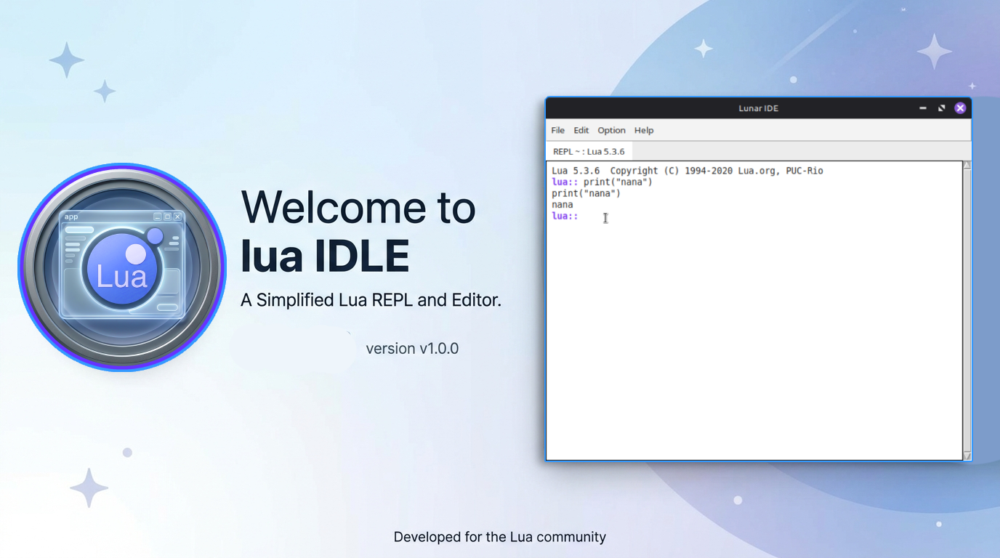
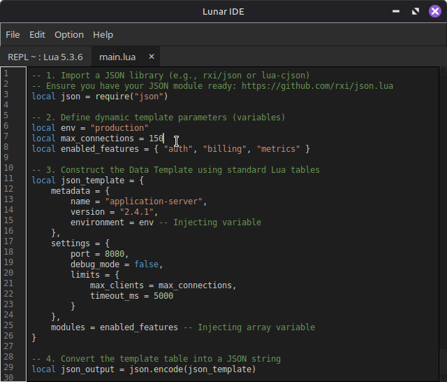
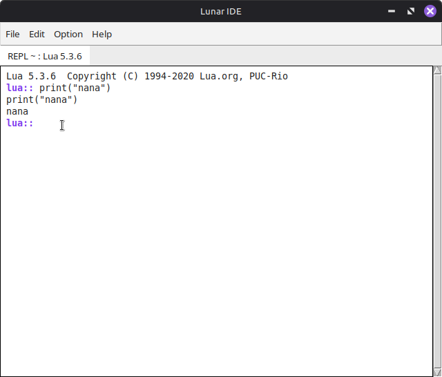

# Lunar IDLE

A minimalist Lua IDLE — editor + REPL in tabs, in a single window.




---

## About

Lunar IDLE is a minimalist Lua IDE, inspired by Python's IDLE, built with
Python and CustomTkinter. It gives you a real Lua REPL and a clean Lua
editor — both living side by side in tabs, in the same window.

Part of the **minguanteEcossys** ecosystem — an effort to bring Lua back
to life.

## Features

- **Real Lua REPL** — talks directly to your system's `lua` binary
  (`lua`, `lua5.4`, `lua5.3`, `lua5.2`, `lua5.1`, or `luajit`).
  No bridges, no emulation.
- **REPL behavior inspired by IDLE** — protected prompt, no editing of
  past output, no accidental overwrites.
- **Lua editor** with line numbers, syntax highlighting, tab = 4 spaces,
  and synchronized scrollbar.
- **Tabs** — REPL, editor, and settings all in the same window.
- **Dark / Light theme.**
- **Configurable fonts** — separate for editor and REPL.
- **Settings in a tab** — no modal windows, no window juggling.
- **Single window**, single file, single purpose.

## Screenshots

### Editor



### REPL



## Requirements

- Python 3.10+
- A Lua binary in your `PATH` (`lua`, `lua5.4`, `lua5.3`, `lua5.2`,
  `lua5.1`, or `luajit`)

## Installation

```bash
git clone https://github.com/codebabel-appbag/lua/lunar_idle.git
cd lunar_idle
python3 -m venv .venv
source .venv/bin/activate   # Windows: .venv\Scripts\activate
pip install -r requirements.txt
python3 main.py
```
## User manual
- `docs/USERMANUAL.md` [USERMANUAL.md](https://github.com/codebabel-appbag/lunar_idle/blob/main/lunaridle_project/source/docs/USERMANUAL.md) — easy user manual.

- `docs/USERMANUAL.pdf` [USERMANUAL.pdf](https://github.com/codebabel-appbag/lunar_idle/blob/main/lunaridle_project/source/docs/USERMANUAL.pdf) — easy user manual.

## License

MIT © codebabel

---

<sub>Part of the **minguanteEcossys** ecosystem — bringing Lua back to life.</sub>
